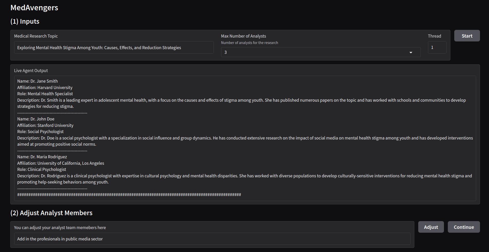

# MedAvengers: A Multi-Agent System for Medical Research

MedAvengers is an advanced, autonomous multi-agent AI system designed to accelerate and enhance medical research. Its architecture follows a structured, three-stage process: Generate Analysts, where AI generates and customizes research teams; Conduct Interviews, where agents autonomously interview experts, sourcing reliable, minimally hallucinated information through Self-RAG (Retrieval-Augmented Generation); and Report Writing, where gathered insights are synthesized into customizable reports. Leveraging 50,000 PubMed articles and Databricks' powerful embedding and model tools, MedAvengers automates complex workflows, reduces researcher workload, and provides scalable, high-quality insights for healthcare innovation.



## How to run demo?

1. Clone the repository

2. Create .env file with key. (see .env.example)

3. Install python dependencies.

```bash
cd MedAvengers
pip install -r requirements.txt
```

4. Run `01_Create_Vector_Search_Index.ipynb` to create Databricks Vector Store Index (VSI)

5. Run application
```bash
gradio app.py
```
6. Open web browser and visit `http://127.0.0.1:7860/`

### More details:

[Youtube] (https://youtu.be/01X1C6aD7XQ)

